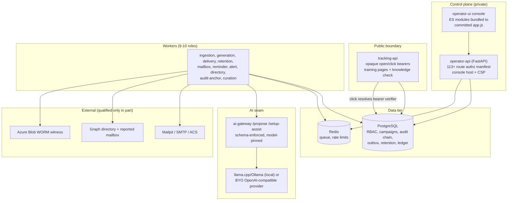

# Independent Adversarial Quality Review — 2026-10-05

**Scope:** full repository at `main` (`f862d72`), reviewed as an independent
architect / QA lead / security reviewer / end-user advocate. Method: systematic
static inspection of apps, packages, scripts, infrastructure, and docs;
cross-checking every documented claim against live code; executing the project's
own verification commands (`make test`, `make lint`, `make typecheck`). No code
was modified. Findings from the 2026-09-27 review were independently
re-verified against the current tree rather than copied.

**Release status is unchanged: NO-GO** for production and RSA Conference use
(consistent with AGENTS.md and the build plan). Nothing in this report upgrades
or downgrades that decision; it re-confirms it and identifies what to fix next.

---

# A. Executive Assessment

| Dimension | Score | Rationale |
|---|---|---|
| Architecturally sound? | **8/10** | A well-factored modular monolith (3 deployables + gateway) with real module boundaries, deterministic policy layers, transactional outbox/audit, and fail-closed defaults. Deducted for a worker→operator-api package dependency that blurs the documented authority boundary (R-03) and a few oversized modules (R-14). |
| Feature complete? | **6/10** | Against the stated on-prem scope almost every claimed feature is genuinely implemented — the safety chain (RoE → frozen audience → approvals → canary → publish), training pipeline, privacy, retention, curation, BYO models are all real code with tests. Deducted because several workflows are complete-but-unwired (aggregation scheduler default-off with no staleness signal, R-07), and every live-provider/browser/restore gate is still unproven, which is part of this product's mission ("defensible outcomes", "GUI-driven operations"). |
| Production ready? | **3/10** | By design and by the project's own evidence policy: no live Azure/Entra/Graph/ACS qualification, no browser/WCAG human pass, no exact-image/AMD64/registry attestation, no D6 human acceptance, no restore/rotation drill on the current topology. The code is closer to production quality than the evidence is; the evidence rules. |
| Safe to use? | **7/10** | The security posture in code is genuinely strong: strict OIDC (PKCE/nonce/state, issuer-bound, DNS-pinned endpoints), fail-closed RBAC, purpose-scoped keyed bearer verifiers, AES-GCM versioned ciphertext, hash-chained audit with WORM witness seam, hardened public edge, redacted logs. Deducted for plaintext BYO keys on disk (R-04) and false egress evidence for custom providers (R-02). |
| Maintainable? | **6/10** | Excellent mechanical hygiene (ruff/format green over 557 files, strict mypy over 188 source files, ~3,500 hermetic tests, bundle-drift gate, explicit route-authorization manifest). Deducted for an 8.8k-line console bundle source module, a 3.0k-line worker jobs module, doc sprawl with stale quantitative claims (R-06), and a load-sensitive test gate (R-01). |
| Easy to use? | **5/10** | The setup wizard, connection probes, readiness computation, and fail-closed messaging are above average. But the console still speaks engineering (Terraform stages, "occurrences", six launch verbs), the first campaign is ~11 interactions across several pages, and a two-person team gets power-tools (queues/dead-letters, model control, threat workbench) at the same nav level as their daily work. |

**Bottom line:** this is not a facade over stubs. The code does what the docs
claim at the local/static level, the safety-critical paths are deterministic and
fail-closed, and the test culture is unusually disciplined. The product is
**not** production-ready — correctly self-declared — and the highest-value work
now is (1) making the evidence pipeline trustworthy (R-01), (2) truthful
operator-facing evidence (R-02, R-04, R-05), and (3) reducing the console's
cognitive load before D6 human acceptance.

---

# B. System Architecture (as actually implemented)

Key implemented properties (verified in code, not just docs):

- **Deterministic policy, not AI, owns safety.** Generation output passes a
  strict request/response contract (`kp_contracts.generation`), the
  allow-list HTML sanitizer keeps only the training placeholder link
  (`kp_sanitization.safe_html`), and a human approves whatever survives.
- **Two-phase launch is server-derived.** `schedule_campaign` queues only the
  reviewed canary cohort; `publish_campaign` requires `canary_succeeded`
  evidence with provider + config hash, unexpired, RoE still covering, frozen
  audience unchanged, and excludes canary recipients idempotently
  (`routes/campaigns.py:1242–1520`).
- **AuthN/Z is strict.** OIDC endpoints are issuer-bound, DNS-resolved and
  pinned per request; JWKS/discovery fetches are streamed and byte-bounded;
  roles map to capabilities and unknown roles grant nothing (`auth.py`).
- **Fail-closed seams are pervasive** (emergency stop, terms acknowledgement,
  source-disable fence, kill switch, mis-matching model pin, missing action
  flags).

---

# C. Requirements Traceability Matrix

Status legend: COMPLETE (implemented + tested at local/static level) ·
PARTIAL · MISSING · BROKEN · IMPLEMENTED DIFFERENTLY · UNVERIFIED (exists but
this review could not prove live behavior).

| # | Requirement (source) | Expected behavior | Components | Actual | Tests | Status | Notes |
|---|---|---|---|---|---|---|---|
| 1 | Single-tenant console install (README, plan) | install → configure → start → use on macOS/Linux | `scripts/install.sh`, preflight, supervisor | Idempotent installer, disk gate, preserved-volume identity checks, first-run password | launcher/contract tests | **COMPLETE** (local) | Good first-run story; see I section for residual steps |
| 2 | Deterministic authorization + RBAC snapshots (plan) | capabilities enforced server-side; fail closed | `kp_authorization`, `auth.py`, route manifest | Implemented; explicit per-route manifest enforced by tests | route-inventory tests | **COMPLETE** | MANAGE_ROLES reused as generic settings capability (R-13) |
| 3 | OIDC (Entra-compatible) + dev loopback mode | PKCE/nonce/state, exact iss/aud, role mapping | `auth.py`, `console_auth` | Implemented incl. DNS pinning and cross-origin redirect refusal | auth/oidc tests | **COMPLETE** (local) | Live Entra **UNVERIFIED** |
| 4 | Signed RoE + exact audiences + frozen manifests | fail closed on wildcard/malformed/unicode domains | `sending_domains_roe`, campaign service | Implemented as documented | extensive | **COMPLETE** | |
| 5 | Two-phase launch: reviewed canary → separate full publish | server-derived evidence bound to unchanged review | `routes/campaigns.py`, launch gate model | Implemented; canary expiry, provider/config-hash binding | canary-gate tests | **COMPLETE** | Strongest-safety code in repo |
| 6 | AI generation via strict contract + human approval | bounded streamed JSON, pinned model, placeholder binding | `kp_contracts`, `ai-gateway`, `jobs.py` | Implemented; model pin fail-closed | generation pipeline tests | **COMPLETE** (local) | Pin vs fallback contradiction (R-05) |
| 7 | BYO generation providers (2026-09 cycle) | encrypted keys, explicit egress decision, console selector | `console/ai_providers.py`, gateway state file | Implemented | provider tests | **PARTIAL** | False offsite evidence for `custom` (R-02); plaintext key file (R-04) |
| 8 | Threat curation (forward-a-phish) | bounded MIME extraction, deterministic clone, DRAFT only | `curation_jobs`, `curation_mime`, `clone_service` | Implemented (Mailpit + Graph sources) | curation tests | **COMPLETE** (local) | Silent fetch-skip (R-11) |
| 9 | Training pipeline (assignment → purpose-bound links → knowledge check) | purpose-separated bearers, idempotent completion, 72h due | tracking-api, workers, TRN-010 | Implemented as documented | extensive | **COMPLETE** | |
| 10 | Reporting: funnels, trends, named outcomes, CSV, ledger (ANA-010) | denominator-explicit, capability-protected | `reporting.py`, analytics routes | Implemented | analytics tests | **COMPLETE** | Staleness UX gap (R-07) |
| 11 | Privacy/DSR + retention bounds | encrypted PII, single current notice, 365d raw / 1,826d ledger | `privacy.py`, retention jobs | Implemented | retention concurrency tests | **COMPLETE** | |
| 12 | Audit chain + dispatcher + WORM witness | hash chain, aggregate-only verification output | `audit_store`, `audit_anchor_jobs` | Implemented; local permission boundary tested | audit tests | **COMPLETE** (local) / **UNVERIFIED** (live WORM) | AUD-003 alert seam now wired (prior F1 closed) |
| 13 | Public tracking hardening | caps, duplicate CL rejection, trusted-proxy chain, no-store headers | `tracking-api` middleware/routers | Implemented | tracking tests | **COMPLETE** | |
| 14 | Mail delivery: Mailpit / SMTP / ACS | pacing, correlation, receipts | worker providers | Implemented | delivery tests | **UNVERIFIED** live | ACS receipt ingestion is code-complete only |
| 15 | Microsoft 365: Graph directory + reported mailbox | bounded delta/paging, replay, MIME guards | `microsoft365.py`, directory jobs | Implemented | mock-graph tests | **UNVERIFIED** live | |
| 16 | Azure 3-stage deployment + GUI orchestrator | stage gates, digest-bound plans, refusal of deletes | `deployment_orchestration.py`, workflow | Implemented | 2.7k-line orchestration tests | **UNVERIFIED** live | Terraform semantics exposed in GUI (H1, §H) |
| 17 | Recovery / checkpoint / restore | snapshot chain, no-clobber publish | operator scripts | Implemented and historically demonstrated | contract tests | **UNVERIFIED** on current topology | |
| 18 | Observability: health, redacted logs, bounded metrics | dependency-aware `/readyz`, central redaction | `kp_telemetry`, main.py | Implemented | health tests | **COMPLETE** (local) | |
| 19 | Browser console operable by non-engineers | plain language, progressive disclosure | `console-js/app.js` | Implemented but engineering-flavored | substring UI contracts + 2 Playwright specs | **PARTIAL** / **UNVERIFIED** (browser/WCAG) | §H findings |
| 20 | Hermetic + profile test gates as release evidence | deterministic, skip-free, reproducible | `run-hermetic-tests.sh`, Makefile | Hermetic gate strong but **load-sensitive** (R-01) | meta-gates exist | **PARTIAL** | See J |
| 21 | Honest documentation ("Release truth") | numbers reflect the tree | README, plan, handoffs | Qualitative truth strong; quantitative claims stale (R-06) | — | **PARTIAL** | |

---

# D. Critical Findings

No CRITICAL findings. HIGH findings first.

### R-01 — The release-evidence gate is nondeterministic under host load
- **Severity:** HIGH · **Component:** test infrastructure (`tests/test_azure_idle_contract.py::test_start_initialises_the_backend_too`, `scripts/run-hermetic-tests.sh`)
- **Problem:** `make test` at head produced `1 failed, 3505 passed` on a
  loaded host and `3506 passed, 0 failures` on re-run and in isolation. The
  failing test drives `bash azure-idle.sh` through shims in a subprocess and
  observed zero terraform calls; the assertion raises a bare `IndexError` with
  no call log, stdout, or stderr in the failure output.
- **Evidence:** run 1 (2026-10-05, shared host under concurrent test load):
  `IndexError: list index out of range` at `tests/test_azure_idle_contract.py:642`;
  run 2 (same tree): `3506 passed, 111 deselected in 217.94s`; file alone: 38/38 pass.
- **Consequence:** the project treats hermetic pass counts as qualification
  evidence ("2,620 passed, 0 failures" claims in README/plan). A gate that can
  flip red without a code change undermines every count-based evidence claim,
  and its failure output cannot diagnose itself.
- **Fix:** (a) make the test's assertions diagnostic (print `result.stdout`,
  `result.stderr`, and `calls` in the assert message); (b) find and remove the
  nondeterminism — likely a bounded-timeout prerequisite inside `azure-idle.sh`
  that exits before `terraform init` under CPU pressure, or shim/tmp contention;
  (c) add a structural guard: run this file under `pytest --count`/repeat or a
  load-annotated marker so flakiness is caught in CI rather than in review.

### R-02 — Custom BYO provider records false egress evidence
- **Severity:** HIGH · **Component:** `apps/operator-api/src/kp_operator_api/ai_providers.py`, `console/ai_providers.py`, gateway state file
- **Problem:** the `custom` provider preset hard-codes `sends_data_offsite:
  False` and the UI notes "No data leaves your network", but `base_url` is a
  free-form operator string that can point anywhere (including the public
  internet). `select_ai_provider` then writes
  `audit.record(..., detail={"sends_data_offsite": preset.sends_data_offsite})`
  into the tamper-evident audit chain — recording `false` even when the
  endpoint is remote.
- **Evidence:** `ai_providers.py` registry (`custom` preset notes +
  `sends_data_offsite=False`); `console/ai_providers.py:169` audit detail;
  gateway accepts any http(s) base URL (`main.py: _provider_base_url`).
- **Consequence:** the product's core promise is defensible, evidence-bound
  operation. Audit evidence that misstates whether threat content and lure
  generation left the network is a false record in the immutable chain — worse
  than no record.
- **Fix:** derive egress classification at save/select time from the actual
  `base_url` host (loopback/private-IP vs public), store it on the row, and
  record THAT in audit and the UI. Keep an explicit operator attestation field
  ("this endpoint is on my network") with its own audit entry.

### R-03 — Worker package imports the operator API app
- **Severity:** MEDIUM · **Component:** `apps/workers` → `kp_operator_api`
- **Problem:** `apps/workers/pyproject.toml` declares `kp-operator-api` as a
  dependency; `kp_workers/config.py` imports `KPProfile` and
  `curation_jobs.py` imports `curate_forwarded_message` from the control-plane
  app package.
- **Consequence:** the documented architecture ("three deployables with
  separated authorities") is contradicted at the packaging level: the worker
  deployable cannot be built, versioned, or security-scoped independently of
  the operator API, and least-privilege deployment reviews must assume the
  worker carries the entire operator surface in its image.
- **Fix:** move `KPProfile` and the pure curation clone service into
  `packages/domain-models` (or a small `packages/curation`), re-point both
  imports, and add a boundary test (import-linter or a grep-style contract
  test asserting `apps/workers/src` never imports `kp_operator_api`).

### R-04 — BYO API keys written to disk in plaintext
- **Severity:** MEDIUM · **Component:** `console/ai_providers.py::_write_state_file`
- **Problem:** the selected provider's API key is copied, decrypted, into
  `data/run/ai-provider.json` (mode 0600) for the gateway to read per request.
  The DB column is properly `CipherText`, and docs say "keys encrypted", but
  the live copy is plaintext, persists across restarts, and will be captured by
  any backup/DR copy of `data/`.
- **Consequence:** secret-at-rest exposure on the on-prem host; doc claim is
  half-true.
- **Fix:** either (a) have the gateway read the key from the DB via a
  narrow token/role instead of the file (file carries only routing metadata), or
  (b) encrypt the file payload with the existing app KEK and decrypt in the
  gateway; unlink the file on `local` selection (already done) and on shutdown.
  Update the "keys encrypted at rest" wording to cover whatever remains.

### R-05 — Gateway "fail safe to local" contradicts worker "fail closed on model pin"
- **Severity:** MEDIUM · **Component:** `ai-gateway/main.py::_active_provider` vs `jobs.py` model pin
- **Problem:** any problem with the provider state file (missing, oversized,
  invalid JSON, bad base URL) silently falls back to the local upstream. But
  selecting a provider re-pins `KP_WORKER_AI_MODEL_ID` to the provider's model,
  so the fallback response carries the local model id and the worker rejects it
  with "AI response model does not match the pinned generation model" — every
  generation dead-letters with a reason that names the wrong root cause.
- **Consequence:** a transient file/state problem silently changes behavior and
  surfaces as a confusing dead-letter; an operator will chase the wrong cause.
  Also a quiet-egress surprise: none here (fallback is local), but the
  symmetric case — file readable but stale — routes content to a third party
  the operator may believe is deselected.
- **Fix:** make the fallback decision visible and consistent: if a non-local
  provider is selected (DB truth), a gateway that cannot resolve it should
  return a stable `503 provider-unavailable` (dead-letter reason then matches
  reality), or the worker should record `model_mismatch` detail with the
  observed/gateway source. Add an integration test covering
  "selected provider + corrupt state file → named failure, no silent local use".

---

# E. Functional Gaps

**Required (product cannot fulfill its mission without):**
1. Live-provider qualification: Entra OIDC, Graph directory delta, ACS delivery
   + Event Grid receipts, Outlook reported mailbox, DNS readiness. (Tracked;
   remains the gating requirement for any real campaign.)
2. Browser-qualified console pass incl. WCAG + human assistive technology (D3
   re-run is deferred in the current handoff; the console changed substantially
   since the last run).
3. D6 human acceptance walkthrough (operator leg) — explicitly pending in the
   current handoff.
4. Restore/rollback drill on the current `.105`/Azure topology (recovery code
   exists and passed historically on the retired topology).

**Recommended (absence materially harms usability/reliability):**
5. Aggregation staleness/scheduler visibility in the console (R-07; the data
   can silently be days old).
6. Decision-needed notifications and post-publish closure ritual (prior H8/H11;
   the alert provider already exists — small reuse).
7. Diagnostic, deterministic test gate (R-01).
8. Truthful egress labeling and key handling for BYO providers (R-02/R-04).

**Optional:**
9. Weekly outcome digest (prior H10), recipient free-text search (prior H12),
   combined pattern+draft review screen (prior §2.2-3).

---

# F. Architecture Findings

1. **Deployable boundary leak** — R-03 (worker imports operator-api).
2. **Conflicting failure policies across a seam** — R-05; seams should declare
   one policy (fail-closed everywhere, with named errors) — the repo already
   does this well everywhere else.
3. **Oversized modules** — `console-js/app.js` (~8.8k lines, all 20+ views),
   `jobs.py` (~3.0k lines, all worker jobs), `models.py` (1.6k),
   `campaigns.py` (2.5k), `deployment_orchestration.py` (2.2k). Not urgent;
   the drift gate makes the JS split safe when done (prior F13).
4. **Simplification wins already made (credit where due):** the committed
   bundle + drift gate is a good answer to nodeless deploys; the console seam
   split (`console/__init__.py` facade over 8 modules) is well executed; the
   single multi-role worker avoids microservice sprawl; otel-collector was
   correctly demoted to an opt-in profile (prior F3 closed).
5. **No overengineering detected** beyond the Terraform-stage GUI surface (see
   §H1): no unnecessary queues/services/frameworks; abstractions are used where
   they carry policy.

---

# G. Security Findings (ordered by risk)

1. **R-02 (HIGH)** — false offsite-egress evidence for custom providers (audit
   integrity).
2. **R-04 (MEDIUM)** — plaintext provider API keys in `data/run/ai-provider.json`.
3. **R-05 (MEDIUM)** — silent fallback to local model vs fail-closed pin
   (behavioral surprise in a security-sensitive generation path; also stale
   state file could route curated threat content to an unintended third party).
4. **R-13 (LOW)** — `MANAGE_ROLES` gates onboarding/model-control/AI-provider
   settings; semantic mismatch weakens least-privilege review clarity.
5. **Residual, tracked (not new):** console password is a permanent second auth
   path with manual rotation; active KEK lives in Terraform state (documented
   debt); no live WORM/rotation evidence.
6. **Positive verification (no issue found):** no secrets tracked in git
   (`.env`/`.env.bak` ignored); CI uses obviously disposable credentials;
   constant-time compares on all verifier/pin checks; SSRF-conscious egress
   (HTTPS allow-list, DNS pinning, globally-routable-only); CSRF same-origin
   metadata on cookie-authenticated mutations; login throttling; bounded
   streamed upstream fetches; validation responses never reflect rejected
   values.

---

# H. UX Findings (with simpler alternatives)

1. **Terraform internals in the operator console** (stage names, digest-bound
   plans, advance/retry verbs). *Alternative:* "Connect Azure → Validate →
   Deploy" with the three stages collapsed into an Advanced disclosure; keep
   the semantics, hide the vocabulary.
2. **Six launch verbs** (create/submit/review/schedule/canary/publish).
   *Alternative:* two visible buttons — "Send test to canary" and "Send to
   everyone" — with the gate text as supporting copy. (Send-time spread and
   list timestamps landed since the last review; the vocabulary did not.)
3. **~20 sidebar destinations** including power tools. *Alternative:* a
   role-aware default landing page ("What needs my attention" = readiness
   checklist + pending decisions + last campaign state), demote queues/model
   control/threat workbench to an "Advanced" group.
4. **First campaign ≈ 11 interactions across pages.** *Alternative:* make the
   existing readiness computation the landing view with inline per-step
   buttons until first publish (zero new endpoints).
5. **Staleness is invisible** (R-07): trend/aggregation views don't say when
   data was last refreshed or that auto-refresh is off. *Alternative:* one line
   — "Updated 6 hours ago · automatic refresh off" — with a "Refresh now" button.
6. **Raw UUID fragments** rendered as identity (R-10). *Alternative:* route
   every site through the existing `recipientLabel` helper.
7. **Dead-letter reasons can mislead** (R-05). *Alternative:* named, actionable
   error classes surfaced in the queue view ("generation provider unavailable —
   reselect provider in Settings").

---

# I. Installation and Operations Findings

1. **Install path is genuinely good:** idempotent `install.sh`, disk-headroom
   gate, preserved-volume identity fail-closed behavior, frozen `uv.lock`,
   digest-pinned images, one-click launcher with re-entry detection. First-run
   password setup has an explicit 428 flow. Verified by reading, not a clean
   machine run (**UNVERIFIED** as a from-scratch install in this review).
2. **R-08 (carried F5):** supervised mode demands `KP_WORKER_DATABASE_URL_<ROLE>`
   for every role; a missing var is a runtime crash. Offer an explicit
   shared-URL fallback flag for single-tenant deployments.
3. **R-06 doc drift (carried F6):** tracked root docs (`QA_TASKS.md`,
   `RESUME-HERE.md`) and stale quantitative claims (migrations "head 0033" vs
   actual 0042; "2,620 tests" vs 3,506; "113 routes" vs ~144 route decorators;
   "nine worker roles" vs 10 incl. curation). README is the first thing a new
   operator reads; wrong numbers erode trust and misdirect agents.
4. **Operations remain script-oriented** (deploy via `git pull` + restart marker
   on `.105`; gateway restart by killing a root-owned systemd unit). Acceptable
   for on-prem engineering, but contradicts the product goal "routine operation
   is GUI-driven" — worth tracking as a known gap in the runbook.
5. Backup/restore: `data/` now holds a plaintext key file (R-04) — backup
   hygiene guidance must be updated.

---

# J. Testing Findings

1. **Broken/nondeterministic:** `tests/test_azure_idle_contract.py::test_start_initialises_the_backend_too`
   failed in one full run and passed in isolation and in a clean re-run (R-01).
   Its failure output is non-diagnostic (bare `IndexError`).
2. **Misleading-test risk (carried F10):** ~25 `test_*_ui_contract.py` files are
   substring assertions over `console-js/app.js` source. They catch deletions,
   not behavior. The GUI is the product; its behavioral net (2 Playwright specs)
   is excluded from `make test` and CI and needs a live stack + tunnel.
3. **Verified passing in this review:** `make test` (3,506 passed / 111
   deselected, second run), `make lint` (ruff + format over 557 files), strict
   `make typecheck` (188 source files). Profile gates (PostgreSQL, Redis,
   fresh-migration, E2E) were **not run here** (require Docker/remote) —
   **UNVERIFIED** in this review; the repo's last recorded runs are dated
   2026-08-29/31 and are stale relative to head `0042`/`f862d72`.
4. **Missing tests, prioritized:**
   - **P0:** gateway-state-file failure contract (R-05): selected external
     provider + unreadable state file must yield a named failure, never silent
     local substitution. Egress-classification audit truth (R-02): `custom` +
     public base URL must record offsite evidence, not `false`.
   - **P1:** worker→package boundary test (R-03); load-tolerance or
     diagnostics for subprocess contract tests (R-01); a CI-able console
     behavioral smoke (login → readiness → one mutation) via
     `docker-compose.e2e.yml` (carried F10).
   - **P2:** aggregation staleness surfacing (R-07 UI); per-role DB URL
     misconfiguration message (R-08); curation fetch-failure logging (R-11).
   - **P3:** recipient-label rendering sites (R-10).

---

# K. Technical Debt (meaningful only)

1. Single 8.8k-line console module and 3.0k-line `jobs.py` (R-14) — split along
   existing view/job boundaries behind the drift gate.
2. Documentation number drift (R-06) — treat counts as generated or remove them.
3. KEK-in-Terraform-state and no rotation drill (documented debt; keep visible).
4. `MANAGE_ROLES` overloaded as the settings-admin capability (R-13).
5. UI contract-test style (string greps) — replace opportunistically with the
   behavioral harness as views are touched.

**Explicitly not debt (do not "fix"):** the committed console bundle + drift
gate; the single multi-role worker; the console seam facade; deterministic
clone/curation pipeline; the two-phase launch gate's strictness.

---

# Remediation Plan (executable waves)

Terminology matches the repo (capabilities, launch gate, canary, outbox,
hermetic profiles). Every task is sized for one PR and verifiable by the named
tests. No task weakens a safety gate.

## Wave 0 — Evidence integrity and safety truth (do first)

**T-01 · P0 · Deterministic, self-diagnosing contract tests**
- Problem: R-01. Files: `tests/test_azure_idle_contract.py` (and sibling
  subprocess contract tests), `scripts/operator/azure-idle.sh`.
- Instructions: (1) change `_run_script`-based assertions to include
  `result.stdout`, `result.stderr`, and `calls` in every failure message (e.g.
  `assert terraform_calls, f"no terraform calls; stdout={result.stdout!r} stderr={result.stderr!r} calls={calls!r}"`).
  (2) Reproduce under load (`stress`/parallel pytest) to find the early-exit
  path in `azure-idle.sh start` before `terraform init`; make that path either
  deterministic (retry/raise the bound) or explicitly skip-safe. (3) Add a CI
  job step that runs `tests/test_azure_idle_contract.py` twice back-to-back.
- Acceptance: no bare `IndexError`/`StopIteration` assert failures remain in the
  file; the suite passes 10 consecutive full runs on a loaded host; a forced
  early-exit prints the script's stdout/stderr in the assertion.
- Tests: the file itself; new `test_run_script_failures_are_self_diagnosing`.

**T-02 · P0 · Truthful egress evidence for BYO providers**
- Problem: R-02. Files: `apps/operator-api/src/kp_operator_api/ai_providers.py`,
  `console/ai_providers.py`, gateway `_provider_base_url`, migration for
  `ai_generation_providers` (new `resolved_egress` column or computed field).
- Instructions: classify the effective `base_url` at save/select time
  (loopback/RFC1918/link-local = on-network; otherwise offsite; unresolved =
  unknown), store it, render it in the provider list, and record it in the
  `ai-provider.select` audit detail in place of the preset constant. Keep an
  explicit operator attestation with its own audit entry. Update the `custom`
  preset copy: "No data leaves your network" must only render when the
  classification is on-network.
- Acceptance: selecting `custom` with `https://api.example.com/v1` records
  offsite evidence; with `http://127.0.0.1:11434/v1` records on-network; UI
  label matches; existing tests updated.
- Tests: unit tests for classification; audit-detail contract test; UI-contract
  assertion for the conditional label.

**T-03 · P0 · No silent model fallback**
- Problem: R-05. Files: `apps/ai-gateway/src/kp_ai_gateway/main.py`,
  `apps/workers/src/kp_workers/jobs.py`.
- Instructions: when the DB-selected provider is non-local and the state file
  is unusable, the gateway returns a stable `503` with an allowlisted code
  (e.g. `provider_state_unavailable`) instead of substituting the local
  upstream. The worker maps that to a named dead-letter reason and a metric.
  Keep fail-safe-to-local only when no external provider is selected.
- Acceptance: corrupt state file + selected provider → named failure, zero
  local-model generation; selected `local` → unchanged behavior.
- Tests: gateway tests for each corrupt-file case; worker test asserting the
  dead-letter reason string.

**T-04 · P1 · Protected BYO key material**
- Problem: R-04. Files: `console/ai_providers.py`, `ai-gateway/main.py`.
- Instructions: preferred order — (a) stop writing the key to the state file:
  have the gateway fetch the key via a narrow authenticated internal endpoint
  or direct DB read with its own least-privilege role; (b) if the file must
  carry it, encrypt the payload with the existing app KEK (versioned header)
  and decrypt in the gateway. Ensure the file is removed on `local` selection,
  on managed deployments, and documented in backup guidance.
- Acceptance: `grep` of `data/run/ai-provider.json` shows no plaintext key in
  any reachable state; keys still round-trip for all provider presets.
- Tests: round-trip tests; a test asserting the state file contains no
  `api_key` plaintext; existing provider tests updated.

## Wave 1 — Boundary and workflow correctness

**T-05 · P1 · Extract the worker's shared domain code**
- Problem: R-03. Files: `apps/workers/pyproject.toml`,
  `apps/workers/src/kp_workers/{config.py,curation_jobs.py}`,
  new module in `packages/domain-models` (or `packages/curation`).
- Instructions: move `KPProfile` and `curate_forwarded_message`'s pure logic to
  a package both apps depend on; re-point imports; drop `kp-operator-api` from
  the worker's dependencies; add a boundary contract test
  (`grep -r "kp_operator_api" apps/workers/src` must be empty, enforced in
  `make test`).
- Acceptance: worker tests pass without the operator-api dependency installed;
  boundary test green.
- Tests: new boundary contract test; existing curation/config tests unchanged.

**T-06 · P1 · Aggregation freshness in the console**
- Problem: R-07. Files: `console/aggregation_routes.py`,
  `console-js/app.js` (aggregation view).
- Instructions: add `scheduler: {enabled, last_run_at, last_result}` and
  `data_as_of` to the aggregation status payload; render "Updated X ago ·
  automatic refresh is OFF — run now or enable OPERATOR_API_AGGREGATION_SCHEDULER_ENABLED"
  with a Refresh button. If the scheduler is enabled, render its last run.
- Acceptance: manual run updates `data_as_of`; view states staleness in plain
  language; capability gating unchanged.
- Tests: API contract test; UI-contract assertion for the status line.

**T-07 · P2 · Worker configuration errors name the fix**
- Problem: R-08 (carried F5). Files: `apps/workers/src/kp_workers/__main__.py`.
- Instructions: on a missing `KP_WORKER_DATABASE_URL_<ROLE>`, fail with a
  message naming the variable, the role, and the supported fallback
  (`KP_WORKER_SUPERVISE_SHARED_DB=1` uses `KP_WORKER_DATABASE_URL`); implement
  that fallback flag, default off.
- Acceptance: missing var → one-line actionable error; fallback flag works when
  set and is logged at startup.
- Tests: `apps/workers/tests/test_config.py` cases for both modes.

## Wave 2 — UX simplification (console-only, contract-tested)

**T-08 · P2 · Two-button launch vocabulary**
- Problem: §H2. Files: `console-js/app.js`, UI-contract tests.
- Instructions: rename the visible launch actions to "Send test to canary" and
  "Send to everyone"; keep "schedule"/"publish" as secondary text in the
  confirmation summary. No endpoint or state changes. Update every
  `*_ui_contract.py` string in the same PR.
- Acceptance: the two buttons are the only launch affordances; readiness copy
  explains the gate in one sentence; drift gate + contracts green.

**T-09 · P2 · First-campaign checklist landing view**
- Problem: §H4. Files: `console-js/app.js`.
- Instructions: when zero campaigns have been published, render the existing
  readiness computation as the default landing view: domain/RoE, recipients,
  content, review, test send, publish — each row with its inline action button
  and current state. No new endpoints (reuse existing status payloads).
- Acceptance: a fresh install's home screen shows the checklist with working
  deep links; after first publish the normal dashboard appears.

**T-10 · P2 · Stop-control consolidation + plain labels**
- Problem: §H1/H3. Files: `console-js/app.js`.
- Instructions: single "Stop" control with two scopes ("This campaign" →
  recall+pause; "Everything" → emergency stop), each with a one-line consequence
  statement. Collapse the Azure deployment view to "Connect / Status /
  Advanced" with the three Terraform stages under Advanced (data unchanged).
- Acceptance: no three-red-buttons ambiguity; stage vocabulary visible only
  under Advanced.

**T-11 · P3 · Identity labels + dead-letter reasons**
- Problem: R-10, §H7. Files: `console-js/app.js`, queue views.
- Instructions: route the remaining `slice(0,8)` sites through
  `recipientLabel`; render dead-letter reasons from the new named error codes
  (T-03) with one-line remediation.

## Wave 3 — Operational truth

**T-12 · P2 · Documentation reconciliation**
- Problem: R-06. Files: `README.md`, `docs/WAVE-BUILD-PLAN.md`, root handoffs.
- Instructions: replace hard-coded counts (tests, routes, migration heads,
  worker roles) with generated references or "as of <commit>" statements; run a
  one-time fact check against the tree (migration head `0042`, route manifest
  test output, `make test` count). `git mv` superseded root handoffs into
  `docs/archive/` per the 09-27 plan item 9 (no deletion).
- Acceptance: every number in README matches a machine-checkable source;
  exactly one current handoff pointer at root.
- Tests: a small contract test asserting README's migration-head claim matches
  `alembic heads` output (cheap, prevents recurrence).

**T-13 · P2 · Backup/secret hygiene note + key-file lifecycle**
- Depends on T-04. Files: `docs/OPERATOR-GUIDE.md`, RUNBOOK.
- Instructions: document exactly what `data/run/` contains and what backup
  copies must treat as secret; add the file lifecycle to the runbook.

## Wave 4 — Testing depth (after Waves 0–1 so churn lands once)

**T-14 · P1 · CI-able console behavioral smoke**
- Problem: §J2 (carried F10). Files: `tests/e2e/`, `docker-compose.e2e.yml`,
  Makefile.
- Instructions: extend the Playwright smoke to login → readiness checklist →
  one benign mutation against the disposable e2e stack; add
  `make test-console-smoke`; wire into CI as a non-hermetic job.
- Acceptance: runs headless in CI without a manual tunnel; failure screenshots
  retained.

**T-15 · P2 · Failure-mode tests for the seams touched this cycle**
- curation fetch failure (R-11) must log a warning with counts; provider
  selection with constraint failure must leave no orphan state file (assert the
  existing commit-before-side-effects ordering); aggregation with empty data
  renders "no data yet", not an error.

## Wave 5 — Release evidence (operator-gated, unchanged in scope)

**T-16 · P0 (release) · Re-run profile gates at head** — PostgreSQL,
fresh-migration, Redis, E2E on the `.105` engine at migration head `0042`;
record counts in the evidence ledger (the last recorded profile runs predate 9
migrations and the entire on-prem feature cycle).
**T-17 · P0 (release) · D3 browser/WCAG + D6 human acceptance** per the
deferred handoff items.
**T-18 · P0 (release) · Azure staging re-qualification** (bring staging up per
handoff §2, deploy this cycle, Foundry/Graph wiring, verify, re-idle) and the
exact-image/AMD64/registry gate.

---

# Plan self-review (per section 32)

**Senior architect:** No redesign proposed; T-05 moves code between packages
without behavior change and is sequenced before UI work only where it touches
the same files. T-02's migration is additive. No hidden dependency: T-03
unblocks T-15's dead-letter test and T-11's messages. Sequencing risk:
T-01 must land first because every later claim rests on the gate.

**Senior developer:** Task instructions name exact functions/files and the
decision points (e.g., T-03's "keep fail-safe-to-local only when no external
provider is selected" resolves the policy conflict explicitly). T-02 needs a
small decision (store classification vs recompute) — storing is specified to
keep audit deterministic. T-04's two options are ordered, not left open.

**QA lead:** Each task carries acceptance criteria and named tests. Edge cases
covered: corrupt state file variants (T-03), loopback vs public classification
(T-02), missing-var and fallback modes (T-07), loaded-host reruns (T-01).
Regression risk is contained by the existing contract suite; T-08/T-09 must
update UI-contract strings in-PR (stated).

**Security engineer:** No gate is weakened. T-02 strengthens audit truth; T-04
reduces secret exposure; T-05 improves least-privilege packaging. One caution
recorded: T-04 option (a) — a key-fetch endpoint — must be loopback/identity
scoped, not reachable from the console; option (b) is safer if that cannot be
guaranteed, and the task says to prefer whichever keeps the key off disk in
plaintext.

**End user:** Waves 0–1 change what the user *sees* only where the current
behavior misleads (staleness, dead-letter reasons). Wave 2 reduces steps and
vocabulary without adding features. Nothing moves complexity onto the user; no
new configuration is introduced (T-07 adds a flag that *removes* a failure
mode).

---

*End of review. No repository code was modified; this document is the only
artifact produced.*
